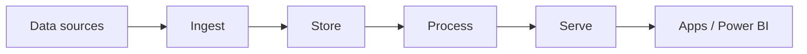

# Azure Databricks Platform Architect

Справочник по платформе Azure Databricks: определение, назначение и ограничения
каждого ресурса и правила, со ссылками на официальную документацию.

## Оглавление

- [Azure Foundation](#azure-foundation): [Azure Hierarchical Structure](#azure-hierarchical-structure) · [Control Plane and Data Plane](#control-plane-and-data-plane)
- [Reference Architecture](#reference-architecture): [Lakehouse Reference Architecture](#lakehouse-reference-architecture) · [Medallion Architecture](#medallion-architecture)
- [Cost Management](#cost-management): [Cost Saving Features](#cost-saving-features)
- [Workspace Planning](#workspace-planning): [Workspace Planning Questions](#workspace-planning-questions) · [Requirements to Get Started](#requirements-to-get-started)
- [Network Security](#network-security): [VNet Injection](#vnet-injection) · [Secure Cluster Connectivity (SCC)](#secure-cluster-connectivity-scc) · [Azure Private Link](#azure-private-link)
- [Identity and Access](#identity-and-access): [SCIM](#system-for-cross-domain-identity-management-scim) · [External User Types in Azure Active Directory](#external-user-types-in-azure-active-directory)
- [Data Governance](#data-governance): [Unity Catalog](#unity-catalog)
- [Network Administration](#network-administration): [SDN](#software-defined-network-sdn) · [Additional Networking Topics and Concepts](#additional-networking-topics-and-concepts) · [Subnets](#subnets) · [CIDR Ranges](#cidr-ranges) · [VNet Peering](#vnet-peering) · [User-Defined Routes (UDR)](#user-defined-routes-udr)
- [Data Loss Prevention](#data-loss-prevention): [Data Exfiltration](#data-exfiltration) · [Azure Features for DLP](#azure-features-for-dlp) · [Azure Databricks Features for DLP](#azure-databricks-features-for-dlp) · [Additional DLP Topics](#additional-dlp-topics)
- [Endpoints](#endpoints): [Private Endpoints](#private-endpoints) · [Service Endpoints](#service-endpoints)

## Azure Foundation

### Azure Hierarchical Structure

**Определение.** Azure Hierarchical Structure — пятиуровневая иерархия ресурсов
Azure: Account → Tenant → Subscription → Resource Group → Resources.

**Назначение.** Определяет, кто платит, где живут identity и на каком уровне
применяются права и квоты. Workspace Azure Databricks создаётся внутри
конкретной пары Subscription и Resource Group.

**Как работает.**

| Level | Роль |
| --- | --- |
| `Account` | биллинг Microsoft: кто платит |
| `Tenant` | Azure Active Directory (ныне Microsoft Entra ID): users, groups, SSO |
| `Subscription` | счёт, Azure RBAC (Role-Based Access Control), квоты |
| `Resource Group` | контейнер жизненного цикла: деплой и удаление пачкой |
| `Resources` | VNet (Virtual Network), ADLS (Azure Data Lake Storage), Key Vault, Databricks workspace |

**Ограничения.** Квоты subscription на vCPU и публичные IP-адреса ограничивают
предельный размер кластеров.

**Документация.**
[Organize your Azure resources and hierarchy](https://learn.microsoft.com/en-us/azure/cloud-adoption-framework/ready/azure-setup-guide/organize-resources) ·
[What is Azure Resource Manager?](https://learn.microsoft.com/en-us/azure/azure-resource-manager/management/overview)

### Control Plane and Data Plane

**Определение.** Control Plane and Data Plane — разделение платформы на
control plane в подписке Azure Databricks и data plane в подписке заказчика.

**Назначение.** Управление отделено от обработки: Databricks отвечает за
управляющие сервисы, данные и вычисления остаются в облаке заказчика.

**Как работает.**

| Plane | Где | Состав |
| --- | --- | --- |
| Control plane | Azure Databricks Cloud | `Web App`, `Notebooks`, `Jobs`, `Metastore`, `Cluster Manager` |
| Data plane | Azure Customer Cloud | `Clusters`, `Data Sources`, `Secure Integrations` |

- `Metastore` хранит метаданные таблиц: имена и schema, а не сами файлы.
- Control plane и data plane обмениваются данными по TLS.
- Доступ к `Secure Integrations` идёт по TLS с проверкой identity.

**Документация.**
[Azure Databricks architecture overview](https://learn.microsoft.com/en-us/azure/databricks/getting-started/overview) ·
[Networking in Azure Databricks](https://learn.microsoft.com/en-us/azure/databricks/security/network/)

## Reference Architecture

### Lakehouse Reference Architecture

**Определение.** Lakehouse Reference Architecture — референсная схема платформы
данных на Azure: пять стадий от источников до потребителей.

**Назначение.** Задаёт, какой сервис Azure отвечает за каждую стадию, чтобы
compute, storage и подача данных не смешивались в одном компоненте.

**Как работает.**

| Stage | Purpose | Services |
| --- | --- | --- |
| Data sources | откуда данные | sensors / IoT, logs, media, files, business apps |
| Ingest | как забрать | streaming: Event Hubs, IoT Central, Kafka; batch: Azure Data Factory |
| Store | куда класть сырьё | Azure Data Lake Storage (ADLS) |
| Process | где считать | Azure Databricks: Spark, MLflow, Azure ML |
| Serve | кому отдать | AKS, Cosmos DB, SQL Database, Synapse, Power BI, apps |

**Актуально.** Для ingest сегодня используются Auto Loader и Lakeflow Connect,
для serve — Databricks SQL и Mosaic AI Model Serving.

**Документация.**
[Lakehouse reference architectures](https://learn.microsoft.com/en-us/azure/databricks/lakehouse-architecture/reference) ·
[What is Auto Loader?](https://learn.microsoft.com/en-us/azure/databricks/ingestion/cloud-object-storage/auto-loader/)

### Medallion Architecture

**Определение.** Medallion Architecture — многослойная модель данных, в которой
качество данных растёт при переходе Raw → Bronze → Silver → Gold.

**Назначение.** Каждый слой имеет свой контракт данных, поэтому ошибка
обработки исправляется переигрыванием слоя, а не повторным сбором источников.

**Как работает.**

| Layer | Где живёт | Контракт данных | Потребитель |
| --- | --- | --- | --- |
| Raw | файлы в ADLS | JSON, CSV, Parquet как пришли | только ingest |
| Bronze | Delta table | schema источника плюс технические поля | replay, audit, reprocess |
| Silver | Delta table | очищенные сущности, ключи, типы | engineering, DS, ML |
| Gold | Delta table | витрины под бизнес-вопрос | BI, apps, serving |
| Serve | вне озера | Cosmos DB, Synapse, Power BI, apps | конечные потребители |

- Bronze пишется «почти as-is» с полями `_ingest_time`, source, filename.
- Silver выполняет join, dedup, CDC merge и проверки качества; grain — сущность.
- Compute на всех переходах внутри озера — Azure Databricks.

**Документация.**
[What is the medallion lakehouse architecture?](https://learn.microsoft.com/en-us/azure/databricks/lakehouse/medallion) ·
[Delta Lake on Azure Databricks](https://learn.microsoft.com/en-us/azure/databricks/delta/)

## Cost Management

### Cost Saving Features

**Определение.** Cost Saving Features — четыре механизма снижения стоимости
Azure Databricks: `Cluster Auto-shutdown`, `Elastic cluster sizes`,
`Pre-purchase plan`, `Standard vs. Premium tier`.

**Назначение.** Счёт складывается из DBU (Databricks Unit) и инфраструктуры
Azure. Механизмы уменьшают либо время работы compute, либо ставку за DBU.

**Как работает.**

- `Cluster Auto-shutdown` — остановка кластера после заданного простоя.
- `Elastic cluster sizes` — autoscaling числа worker в границах min и max.
- `Pre-purchase plan` — предоплата DBCU (Databricks Commit Units) на 1 или 3 года.
- `Standard vs. Premium tier` — Premium дороже за DBU и добавляет функции контроля доступа.

**Ограничения.** Pre-purchase покрывает только DBU: VM, storage и трафик
тарифицируются Azure отдельно.

**Документация.**
[Azure Databricks pricing](https://www.databricks.com/product/azure-pricing) ·
[Azure pricing calculator](https://azure.microsoft.com/en-us/pricing/calculator/) ·
[Save on Azure Databricks DBUs with pre-purchase](https://learn.microsoft.com/en-us/azure/cost-management-billing/reservations/prepay-databricks-reserved-capacity) ·
[Compute configuration reference](https://learn.microsoft.com/en-us/azure/databricks/compute/configure)

## Workspace Planning

### Workspace Planning Questions

**Определение.** Workspace Planning Questions — набор вопросов, на которые
отвечают до создания workspace.

**Назначение.** Сетевой режим, публичные IP и подключение к on-premises
задаются при развёртывании, поэтому ошибка на этом шаге исправляется
пересозданием workspace, а не изменением настройки.

**Как работает.**

- Назначение workspace и срок его существования.
- Нужен ли публичный IP; если нет — как организована связь.
- Требования безопасности и доступа.
- Наличие on-premises систем, с которыми нужна связь.
- Как доступ будет отслеживаться и ограничиваться; используется ли Unity Catalog.

**Документация.**
[Networking in Azure Databricks](https://learn.microsoft.com/en-us/azure/databricks/security/network/) ·
[Azure Databricks account settings](https://learn.microsoft.com/en-us/azure/databricks/admin/account-settings/)

### Requirements to Get Started

**Определение.** Requirements to Get Started — ресурсы и параметры, которые
готовят до развёртывания workspace.

**Назначение.** Развёртывание запрашивает их сразу: отсутствие VNet или storage
account останавливает создание workspace.

**Как работает.**

- При VNet injection — существующая или новая VNet в Azure.
- Storage account (или несколько) для данных.
- Credentials и конфигурации дополнительных сервисов для интеграции.
- Имя workspace.
- Subscription, resource group и region для workspace.

**Документация.**
[Deploy Azure Databricks in your VNet (VNet injection)](https://learn.microsoft.com/en-us/azure/databricks/security/network/classic/vnet-inject)

## Network Security

### VNet Injection

**Определение.** VNet Injection — развёртывание classic compute plane в VNet
подписки заказчика вместо управляемой сети Databricks.

**Назначение.** Даёт организации контроль над маршрутизацией, NSG (Network
Security Group), Private Endpoint и связью с on-premises. Без injection
периметр compute задаёт Databricks.

**Как работает.**

- VNet содержит две delegated subnet: private и public.
- Каждый узел получает NIC (Network Interface Card) с частным IP из subnet.
- NSG применяется на subnet, container rules — на контейнер узла.
- Связь с control plane идёт через relay и load balancer (NPIP v2).
- Peering связывает VNet с остальными ресурсами Azure по частным адресам.

**Ограничения.** Диапазоны VNet и subnet задаются при создании workspace и
определяют предел одновременно работающих узлов.

**Документация.**
[Deploy Azure Databricks in your VNet (VNet injection)](https://learn.microsoft.com/en-us/azure/databricks/security/network/classic/vnet-inject) ·
[What is Azure Virtual Network?](https://learn.microsoft.com/en-us/azure/virtual-network/virtual-networks-overview)

### Secure Cluster Connectivity (SCC)

**Определение.** Secure Cluster Connectivity (SCC), также No Public IP (NPIP), —
режим, в котором узлы classic compute не имеют публичных IP-адресов и не
принимают входящие соединения.

**Назначение.** До SCC control plane обращался к VM data plane через публичный
интернет. SCC разворачивает поток: узел сам инициирует egress-соединение.

**Как работает.**

- Узлы получают только частные IP из subnet заказчика.
- Трафик к control plane идёт только на исходящее соединение узла.
- Снимается зависимость от квоты публичных IP-адресов.

**Варианты и выбор.** SCC вместе с VNet injection считается best practice:
такая комбинация даёт максимум безопасности и гибкости для бизнеса.

**Документация.**
[Secure cluster connectivity](https://learn.microsoft.com/en-us/azure/databricks/security/network/classic/secure-cluster-connectivity)

### Azure Private Link

**Определение.** Azure Private Link — приватное подключение к Azure Databricks
через private endpoint с адресом из VNet заказчика.

**Назначение.** Убирает публичные URL из пути доступа: трафик идёт по
корпоративной сети и Azure backplane, не выходя в интернет.

**Варианты и выбор.**

| Option | Путь | Когда применяют |
| --- | --- | --- |
| 1. End User to Control Plane | пользователь → ExpressRoute или VPN → transit VNet → private endpoint → control plane | workspace нельзя открывать по публичным URL |
| 2. Data Plane to Control Plane | clusters в customer VNet → private endpoint → control plane, metastore, artifact store | control plane доступен только по частным IP |

- В option 2 правила firewall для доступа к control plane не нужны.
- В обоих вариантах трафик маршрутизируется по Azure backplane.

**Документация.**
[Enable Azure Private Link](https://learn.microsoft.com/en-us/azure/databricks/security/network/classic/private-link)

## Identity and Access

### System for Cross-Domain Identity Management (SCIM)

**Определение.** System for Cross-Domain Identity Management (SCIM) —
стандартный протокол синхронизации users, groups и service principal из Azure
Active Directory в Azure Databricks.

**Назначение.** Одна identity в Azure Active Directory становится account user
и далее workspace user в нескольких workspace. Без синхронизации учётные записи
создаются в каждом workspace вручную.

**Как работает.**

- Identity создаётся в Azure Active Directory.
- Provisioning передаёт её на уровень account: account user или service principal.
- С уровня account identity назначается в конкретные workspace.

**Ограничения.** Отзыв доступа выполняется в источнике: identity, оставшаяся в
workspace без синхронизации, сохраняет доступ.

**Документация.**
[Sync users and groups from Microsoft Entra ID using SCIM](https://learn.microsoft.com/en-us/azure/databricks/admin/users-groups/scim/aad)

### External User Types in Azure Active Directory

**Определение.** External User Types in Azure Active Directory — два типа
внешних пользователей: B2B (Business-to-Business) и B2C (Business-to-Customer).

**Назначение.** Определяет, кому вообще можно выдать доступ к workspace:
подрядчику или партнёру — можно, потребительской identity — нет.

**Как работает.**

| Тип | Кто это | Доступ к Azure Databricks |
| --- | --- | --- |
| B2B | vendors, contractors, partners; добавляются в Azure Active Directory напрямую, роль Guest, вне домена | доступ возможен |
| B2C | аутентификация через сторонние системы (Facebook, Google, Apple), в Azure Active Directory не добавляются, ограниченный доступ | workspace использовать нельзя |

**Документация.**
[B2B collaboration overview](https://learn.microsoft.com/en-us/entra/external-id/what-is-b2b)

## Data Governance

### Unity Catalog

**Определение.** Unity Catalog — централизованный уровень governance для данных
и AI-объектов: единый каталог, права доступа и аудит для всех workspace в account.

**Назначение.** Права определяются один раз на уровне account и действуют во
всех workspace, вместо повторной настройки доступа в каждом workspace.

**Как работает.**

- `Define once, secure everywhere` — единая модель прав для всех workspace.
- `Standards-compliant security model` — ANSI SQL GRANT на объекты каталога.
- `Built-in auditing` — журнал обращений к объектам.

**Ограничения.** Metastore создаётся на region: workspace подключается к
metastore своего региона.

**Документация.**
[What is Unity Catalog?](https://learn.microsoft.com/en-us/azure/databricks/data-governance/unity-catalog/)

## Network Administration

### Software Defined Network (SDN)

**Определение.** Software Defined Network (SDN) — сетевая модель, в которой
топология и политики задаются программно, а не настройкой оборудования.

**Назначение.** Сеть Azure создаётся и меняется как ресурс через API и
шаблоны, поэтому сетевой периметр workspace воспроизводим и версионируем.

**Как работает.** Три основных компонента:

- `Network Controller` — централизованное управление конфигурацией сети.
- `Software Load Balancer` — распределение трафика без физического устройства.
- `Gateway` — выход в другие сети: on-premises, другие VNet, интернет.

**Документация.**
[What is Azure Virtual Network?](https://learn.microsoft.com/en-us/azure/virtual-network/virtual-networks-overview)

### Additional Networking Topics and Concepts

**Определение.** Additional Networking Topics and Concepts — шесть базовых
понятий сети Azure, на которых строится сетевая конфигурация workspace.

**Назначение.** Задаёт минимальный словарь сети: адресное пространство, размер
сети, связность, маршрутизация и два способа приватного доступа к сервисам.

**Как работает.**

| Термин | Определение | Подробно |
| --- | --- | --- |
| `RFC 1918` | непубличное, не маршрутизируемое в интернете адресное пространство: блоки `10.0.0.0/8`, `172.16.0.0/12`, `192.168.0.0/16` | — |
| `CIDR` | адрес плюс число значащих бит, образующих маршрутную часть; альтернатива традиционным subnet mask | [CIDR Ranges](#cidr-ranges) |
| `Peering` | соединение двух и более VNet, после которого для связности они выглядят как одна сеть | [VNet Peering](#vnet-peering) |
| `Routes` | custom или user-defined (static) маршруты, переопределяющие системные маршруты Azure или дополняющие route table подсети | [User-Defined Routes (UDR)](#user-defined-routes-udr) |
| `Service Endpoints` | безопасное прямое подключение к сервисам Azure по оптимизированному маршруту через Azure backbone | [Service Endpoints](#service-endpoints) |
| `Private Endpoints` | сетевой интерфейс с частным адресом из VNet, подключающий сервис через Azure Private Link | [Private Endpoints](#private-endpoints) |

**Ограничения.** Адресные пространства связываемых сетей не должны
перекрываться, иначе адрес не разрешается однозначно.

**Документация.**
[What is Azure Virtual Network?](https://learn.microsoft.com/en-us/azure/virtual-network/virtual-networks-overview) ·
[Networking in Azure Databricks](https://learn.microsoft.com/en-us/azure/databricks/security/network/)

### Subnets

**Определение.** Subnets — диапазоны адресов внутри VNet, из которых узлы
получают частные IP.

**Назначение.** Даёт каждому узлу уникальную идентичность в периметре: control
plane адресует ему job, а узел открывает соединение к ADLS. Без уникального IP
узлы неразличимы.

**Как работает.**

- Диапазоны VNet и subnet задаёт администратор при создании workspace.
- Azure выдаёт свободный частный IP каждой NIC при старте кластера.
- При остановке кластера адреса возвращаются в пул.
- Workspace с VNet injection использует две delegated subnet.

**Ограничения.** Исчерпание адресов не даёт стартовать новым кластерам в пик
нагрузки; размер subnet после создания workspace не меняется.

**Документация.**
[Deploy Azure Databricks in your VNet (VNet injection)](https://learn.microsoft.com/en-us/azure/databricks/security/network/classic/vnet-inject)

### CIDR Ranges

**Определение.** CIDR Ranges (Classless Inter-Domain Routing) — диапазоны
адресного пространства в нотации `10.10.0.0/24`: адрес плюс число значащих бит,
образующих маршрутную часть. Альтернатива традиционным subnet mask.

**Назначение.** Задаёт вместимость VNet и subnet, то есть предельное число
одновременно работающих узлов.

**Как работает.** Rule of 4:

- Определить ожидаемое число одновременных узлов кластера.
- Умножить на 2 — public и private subnet.
- Умножить на 2 — запуск и остановка (flash-over).
- Итог примерно вчетверо больше числа одновременных узлов.
- Взять CIDR, дающий следующее по величине адресное пространство VNet.

**Ограничения.** Чем меньше число после `/`, тем больше адресов в пуле.

**Документация.**
[Deploy Azure Databricks in your VNet (VNet injection)](https://learn.microsoft.com/en-us/azure/databricks/security/network/classic/vnet-inject)

### VNet Peering

**Определение.** VNet Peering — соединение двух и более VNet в Azure, после
которого для целей связности они выглядят как одна сеть.

**Назначение.** Даёт частный маршрут между контурами: кластер обращается к ADLS
или к другой VNet по частным IP, минуя публичный интернет.

**Варианты и выбор.**

| Вариант | Область |
| --- | --- |
| `Virtual Network Peering` | VNet в одном region |
| `Global Network Peering` | VNet в разных region |

**Как работает.**

- VNet не обязаны находиться в одной subscription.
- Peering подсетей происходит неявно, отдельной настройки не требует.
- Трафик остаётся в локальной сети и идёт по Azure backplane.

**Документация.**
[Virtual network peering](https://learn.microsoft.com/en-us/azure/virtual-network/virtual-network-peering-overview)

### User-Defined Routes (UDR)

**Определение.** User-Defined Routes (UDR) — пользовательская таблица маршрутов
на subnet, переопределяющая системные маршруты Azure: трафик к заданному
префиксу направляется на указанный next hop.

**Назначение.** Нужен, когда исходящий путь compute должен идти через выбранную
точку контроля — firewall, VPN gateway, NVA (Network Virtual Appliance), — а не
напрямую.

**Как работает.**

| Цель | Маршрут |
| --- | --- |
| Контроль исходящих данных | `0.0.0.0/0` → Azure Firewall |
| Доступ к корпоративным системам | CIDR on-premises → VPN или ExpressRoute |

**Ограничения.** Если весь трафик уходит на firewall без разрешённых маршрутов
к control plane и SCC, кластер не стартует. NSG решает, разрешено ли соединение,
UDR — каким путём оно идёт.

**Документация.**
[User-defined route settings for Azure Databricks](https://learn.microsoft.com/en-us/azure/databricks/security/network/classic/udr) ·
[Virtual network traffic routing](https://learn.microsoft.com/en-us/azure/virtual-network/virtual-networks-udr-overview)

## Data Loss Prevention

### Data Exfiltration

**Определение.** Data Exfiltration — несанкционированный вынос данных за
пределы среды Azure Databricks.

**Назначение.** Тема определяет набор обязательных контролей для регулируемых
данных: без них открытый исходящий путь или широкий доступ к storage делают
вынос данных технически возможным.

**Как работает.** Основные векторы:

- открытый egress из compute;
- слишком широкий доступ к storage account;
- скомпрометированные credentials;
- выгрузка query results или запись во внешний контур.

**Варианты и выбор.** Сетевые меры (VNet injection, SCC, egress через firewall,
Private Link к storage) закрывают путь наружу; Unity Catalog ограничивает доступ
к объектам. IP access lists дополняют их контролем того, откуда открывают UI.

**Документация.**
[Networking in Azure Databricks](https://learn.microsoft.com/en-us/azure/databricks/security/network/)

### Azure Features for DLP

**Определение.** Azure Features for DLP (Data Loss Prevention) — средства Azure,
применяемые для защиты от утечки данных в развёртывании Azure Databricks.

**Назначение.** Ограничивают сетевые пути, по которым данные могут покинуть
периметр, и дают наблюдаемость исходящего трафика.

**Как работает.**

- `User Defined Routes (UDRs)` — направляют egress на точку контроля.
- `Azure Firewalls` — фильтруют исходящие соединения по правилам.
- `Network Behavior Analysis programs` — выявляют аномальный трафик.
- `Private Link (Private Endpoints)` — приватный доступ к сервисам.
- `Service Endpoints` — оптимизированный маршрут к сервисам Azure.

**Документация.**
[What is Azure Private Endpoint?](https://learn.microsoft.com/en-us/azure/private-link/private-endpoint-overview) ·
[Virtual network traffic routing](https://learn.microsoft.com/en-us/azure/virtual-network/virtual-networks-udr-overview)

### Azure Databricks Features for DLP

**Определение.** Azure Databricks Features for DLP — средства защиты от утечки
на стороне платформы: `IP Access Lists` и `Unity Catalog`.

**Назначение.** Сетевые меры Azure не ограничивают, кто открывает workspace и
какие объекты он видит. Эти два средства закрывают именно это.

**Как работает.**

- `IP Access Lists` ограничивают, с каких адресов открывают UI и API workspace.
- `Unity Catalog` управляет доступом к объектам данных из account console.
- Диапазоны Azure Active Directory берутся из service tag `AzureActiveDirectory`.

**Ограничения.** IP access lists контролируют вход в workspace, но не то, куда
кластер отправляет данные: исходящий путь закрывается сетевыми средствами.

**Документация.**
[Configure IP access lists for workspaces](https://learn.microsoft.com/en-us/azure/databricks/security/network/front-end/ip-access-list) ·
[What is Unity Catalog?](https://learn.microsoft.com/en-us/azure/databricks/data-governance/unity-catalog/)

### Additional DLP Topics

**Определение.** Additional DLP Topics — три принципа, на которых строится
модель доступа: `Authentication vs. Authorization`,
`Principle of Least Privilege`, `Zero Trust Principle`.

**Назначение.** Задают, как выдаются права, независимо от конкретного сервиса:
сначала подтверждение identity, затем минимально достаточные права.

**Как работает.**

- Authentication подтверждает identity, authorization определяет разрешённые действия.
- Least privilege выдаёт только права, необходимые для задачи.
- Zero trust не считает сеть доверенной: каждое обращение проверяется.

**Документация.**
[Azure Databricks account settings](https://learn.microsoft.com/en-us/azure/databricks/admin/account-settings/)

## Endpoints

### Private Endpoints

**Определение.** Private Endpoints — сетевые интерфейсы с частными адресами
RFC 1918 из VNet заказчика, создающие приватное подключение к сервису через
Azure Private Link.

**Назначение.** Даёт публичному ресурсу локальную идентичность внутри сети:
обращение к нему идёт по частному IP, доступному в локальной сети.

**Как работает.**

- Занимает частный IP из subnet заказчика и имеет собственный NIC.
- Создаёт приватное подключение к сервису, доступное внутри локальной сети.
- Работает и для доступа из on-premises через ExpressRoute или VPN.

**Ограничения.** Не убирает публичный доступ к самому ресурсу: публичный
доступ отключается отдельной настройкой на ресурсе.

**Документация.**
[What is Azure Private Endpoint?](https://learn.microsoft.com/en-us/azure/private-link/private-endpoint-overview)

### Service Endpoints

**Определение.** Service Endpoints — настройка subnet, направляющая трафик к
сервисам Azure по оптимизированному маршруту через Azure backbone.

**Назначение.** Ограничивает доступ к storage account адресами конкретной
subnet, не выделяя сервису частный IP в сети заказчика.

**Как работает.**

- Включается на subnet VNet, там же где `Delegate subnet to a service`.
- Обходит default route, SNAT и firewall.
- Бесплатная функция Azure: не требует DNS и не создаёт NIC.
- Управляет только исходящим трафиком.

**Варианты и выбор.**

| Средство | Что даёт | Когда выбирают |
| --- | --- | --- |
| `Service Endpoint` | оптимизированный маршрут от subnet к сервису | достаточно ограничить доступ адресами subnet |
| `Private Endpoint` | частный IP сервиса в VNet | нужен приватный адрес и доступ из on-premises |

**Ограничения.** Нельзя включить в on-premises сетях, только в VNet.

**Документация.**
[Virtual Network service endpoints](https://learn.microsoft.com/en-us/azure/virtual-network/virtual-network-service-endpoints-overview)
